# E-commerce Customer Churn Prediction

A small end-to-end ML system that predicts whether an e-commerce customer is likely to churn: data prep, model comparison with MLflow tracking, explainability, a FastAPI prediction service, tests, and a production architecture writeup.

```mermaid
flowchart LR
    subgraph Sources["Data Sources"]
        A1[Orders / transactions DB]
        A2[Support ticketing system]
        A3[Customer profile / CRM]
    end

    subgraph Batch["Batch Processing & Features"]
        B1[Nightly ETL job]
        B2["Feature engineering<br/>(tenure, RFM, ticket counts)"]
        B3[(Feature store / warehouse table)]
    end

    subgraph Training["Training Pipeline (orchestrated, e.g. Prefect)"]
        C1[Load features + labels]
        C2["Train/val/test split<br/>70/15/15, stratified"]
        C3["Train candidates:<br/>LogReg, RandomForest, XGBoost"]
        C4["MLflow Tracking<br/>(params, metrics, artifacts)"]
        C5{"Select best<br/>by val PR-AUC"}
        C6["Evaluate once on<br/>held-out test set"]
        C7[(MLflow Model Registry)]
    end

    subgraph Serving["Prediction Serving"]
        D1[FastAPI service]
        D2["Loads model from registry<br/>'Production' alias"]
    end

    subgraph Consumers["Consuming Applications"]
        E1[CRM retention workflow]
        E2[Marketing automation]
        E3[Customer success dashboard]
    end

    subgraph Ops["Monitoring"]
        F1[Prediction/feature logging]
        F2[Drift detection job]
        F3[Alerting]
    end

    A1 --> B1
    A2 --> B1
    A3 --> B1
    B1 --> B2 --> B3
    B3 --> C1 --> C2 --> C3 --> C4
    C3 --> C5 --> C6 --> C7
    C7 --> D2 --> D1
    D1 --> E1
    D1 --> E2
    D1 --> E3
    D1 -.logs.-> F1 --> F2 --> F3
    F3 -.triggers.-> C1
```



## 1. Dataset

Source: [ankitverma2010/ecommerce-customer-churn-analysis-and-prediction](https://www.kaggle.com/datasets/ankitverma2010/ecommerce-customer-churn-analysis-and-prediction) on Kaggle, distributed as `E Commerce Dataset.xlsx` (sheet `E Comm`), 5,630 rows, 16.8% churn rate.

The raw file is **not redistributed in this repo** (Kaggle license). To reproduce:

1. Download the dataset from the link above (requires a free Kaggle account).
2. Place `E Commerce Dataset.xlsx` at `data/raw/E Commerce Dataset.xlsx`.

### Data mapping & assumptions

A typical churn schema (customer ID, age, tenure, order count/value, recency, support contact, subscription tier, country) doesn't map 1:1 onto this dataset, so several fields were adapted or dropped. Reasoning:

| Target field | Source column | Notes |
|---|---|---|
| Customer ID | `CustomerID` | used to drop duplicate customers, not used as a model feature |
| Account tenure | `Tenure` → `tenure_months` | already in months |
| Number of orders | `OrderCount` → `orders` | |
| Average order value | `CashbackAmount` → `average_order_value` | **adapted**: the source has no raw order-value column; cashback amount is the closest available monetary signal. Treated as a proxy, not a literal AOV. |
| Days since last order | `DaySinceLastOrder` → `days_since_last_order` | |
| Support contact | `Complain` → **`complain`** | **adapted & renamed**: the source is a **binary 0/1 "did the customer ever raise a complaint" flag**, not a ticket count. Named `complain` rather than a count-implying name like `support_tickets`, and constrained to `0`/`1` in the API, so the field's name and validation honestly reflect what the data actually is — sending something like `9` no longer silently gets fed to the model as a nonsensical out-of-distribution value. |
| Subscription type | `PreferedOrderCat` → `subscription_type` | **adapted**: preferred product category used as a segment/subscription proxy |
| Country | `CityTier` → `country` | **adapted**: recoded to `Tier 1`/`Tier 2`/`Tier 3`; the source has no country field (single-market dataset) |
| Age | — | **dropped**: not present in the source dataset |
| Churned | `Churn` → `churned` | target |

Several additional behavioural/demographic fields present in the source materially improve prediction and were kept (`satisfaction_score`, `hour_spend_on_app`, `number_of_device_registered`, `number_of_address`, `warehouse_to_home`, `order_amount_hike_pct`, `coupon_used`, `gender`, `marital_status`, `preferred_login_device`, `preferred_payment_mode`) — see `src/config.py`.

The `/predict` API has **5 required fields**: `tenure_months`, `orders`, `average_order_value`, `days_since_last_order`, and `complain` (0/1, for the reason above). Every other field is optional and imputed if omitted.

## 2. Setup

```bash
git clone <this-repo>
cd churn-prediction
python3 -m venv .venv && source .venv/bin/activate
make setup   # pip install -r requirements.txt
```

Place the dataset (see §1), then run the pipeline:

```bash
make data      # clean, map fields, 70/15/15 stratified split -> data/processed/
make eda       # EDA report + figures -> reports/
make train     # train LR / RF / XGBoost, track in MLflow, select + register best
make explain   # SHAP explainability -> reports/
make test      # run the automated test suite
make api       # start the FastAPI service on http://localhost:8000
```

Runs entirely on CPU — the dataset is ~4k training rows, so a full model comparison finishes in about a minute on a laptop; no GPU is needed or used.

To inspect MLflow experiment runs and the model registry: `make mlflow-ui` then open http://localhost:5000.

## 3. Data analysis & preparation

Full report: [`reports/eda_summary.md`](reports/eda_summary.md), figures in `reports/figures/`. EDA is run on the **train split only** to avoid letting val/test data influence any preparation decision (a leakage channel, not just direct row leakage).

Key findings:
- **Class imbalance**: 16.8% churn — informs both the modelling metric (§5) and class weighting.
- **Missingness**: 7 numeric columns (`Tenure`, `WarehouseToHome`, `HourSpendOnApp`, `OrderAmountHikeFromlastYear`, `CouponUsed`, `OrderCount`, `DaySinceLastOrder`) each have ~4-6% missing values, with no pattern tied to churn — treated as missing-at-random, median-imputed inside the pipeline (fit on train only, so no leakage from val/test statistics).
- **Inconsistent category labels**: `PreferredLoginDevice` had both `'Phone'` and `'Mobile Phone'`; `PreferedOrderCat` had both `'Mobile'` and `'Mobile Phone'`; `PreferredPaymentMode` had both `'COD'`/`'Cash on Delivery'` and `'CC'`/`'Credit Card'`. All folded to one canonical label (`src/data_prep.py`).
- **Duplicate customer IDs**: a small number were dropped so the same customer can't appear in more than one split.
- Strongest univariate correlations with churn: `tenure_months` (r=-0.35), `complain` (r=+0.25), `days_since_last_order` (r=-0.16, see caveat in §6), `average_order_value` (r=-0.15).

## 4. Model development

Three approaches, trained on identical preprocessing (median/most-frequent imputation → scaling / one-hot encoding, `ColumnTransformer` fit on train only):

| Model | Why chosen |
|---|---|
| **Logistic Regression** (baseline, `class_weight="balanced"`) | Simple, fast, fully interpretable coefficients — establishes the floor every other model must beat. |
| **Random Forest** (`class_weight="balanced"`) | Handles non-linear feature interactions and mixed feature types with minimal tuning; robust ensemble baseline. |
| **XGBoost** (`scale_pos_weight` set from train class ratio) | Typically strongest on tabular data of this size/shape; handles imbalance natively; trains fast; has first-class SHAP (`TreeExplainer`) support for §6. |

Each model's hyperparameters were tuned with `RandomizedSearchCV` (5-fold stratified CV, scoring = average precision / PR-AUC) **on the train split only**. Neural networks were considered and ruled out: at ~4k rows with mostly tabular, low-cardinality features, tree ensembles outperform NNs here and add unnecessary complexity for both training and deployment.

## 5. Model evaluation

All three candidates were scored on the **validation** split (never seen during hyperparameter search):

| Model | Val ROC-AUC | Val PR-AUC | Val Precision | Val Recall | Val F1 |
|---|---|---|---|---|---|
| Logistic Regression | 0.861 | 0.650 | 0.428 | 0.790 | 0.555 |
| Random Forest | 0.985 | 0.946 | 0.932 | 0.762 | 0.838 |
| **XGBoost (selected)** | 0.979 | **0.949** | 0.940 | 0.881 | 0.910 |

XGBoost was selected for having the best validation **PR-AUC**, with Random Forest a close second and Logistic Regression a clear (expected) floor.

**Held-out test set** (scored exactly once, after model + threshold were already fixed — see §6), at the F1-optimal threshold (0.45) chosen from the validation split:

| Metric | Value |
|---|---|
| ROC-AUC | 0.996 |
| PR-AUC | 0.986 |
| Precision | 0.958 |
| Recall | 0.972 |
| F1 | 0.965 |

Confusion matrix (test, n=845): TN=697, FP=6, FN=4, TP=138.

**Which metric would I prioritise, and why:** with 16.8% churn, accuracy is misleading (predicting "no churn" for everyone would score ~83%). I prioritise **recall / PR-AUC** over precision or plain ROC-AUC: in a retention context, a missed churner (false negative) — a customer who leaves without any retention attempt — is typically more costly than a false positive (an unnecessary retention offer to a customer who would have stayed). PR-AUC is also the more informative aggregate metric than ROC-AUC under this level of imbalance. Precision still matters operationally (it bounds how many wasted retention offers the business sends), so it's reported alongside, and the decision threshold is chosen to F1-optimize the precision/recall trade-off on validation rather than defaulting to 0.5.

## 6. Validation & data leakage

- **70/15/15 stratified split** on the target, computed once in `src/data_prep.py` and reused identically by every downstream step.
- **Train**: hyperparameter search (5-fold CV) for all three candidates.
- **Validation**: model selection (best PR-AUC) and decision-threshold selection (best F1) — used exactly once each, never re-run after seeing test.
- **Test**: scored exactly once, after the model and threshold were already fixed. It never informs model choice, hyperparameters, or the threshold.
- **Leakage prevention specifics**: the `ColumnTransformer` (imputers, scaler, one-hot encoder) is fit only inside the `Pipeline`'s `.fit()` call on train, so validation/test statistics never leak into imputation or scaling; duplicate `CustomerID` rows are dropped before splitting so the same customer can't appear in two splits; EDA (§3) is run on train only.

**Caveat worth flagging**: `days_since_last_order` has a counter-intuitive negative correlation with churn in this dataset (churned customers show *fewer* days since their last order on average, 3.2 vs 4.8 for retained). This is very likely an artifact of how the source system's `Churn` label / snapshot was constructed (e.g. a fixed observation date rather than "no purchase in N days"), not a general e-commerce truth — flagged explicitly rather than "fixed", since silently dropping or flipping a real signal without understanding it would itself be a data-integrity risk.

## 7. Explainability & business reasoning

Full report: [`reports/explainability_summary.md`](reports/explainability_summary.md); figures: `reports/figures/shap_summary.png`, `reports/figures/feature_importance.png`.

Top SHAP drivers (test set): `tenure_months`, `complain`, `number_of_address`, `average_order_value`, `days_since_last_order`. The plain-language summary in that report is written for a non-technical stakeholder and explicitly calls out the `days_since_last_order` caveat above and the model's limitations (single historical snapshot, ~5.6k customers, needs re-validation on real production data with a business-agreed churn definition before being used to automatically gate customer treatment).

## 8. Prediction API

```bash
make api
# POST http://localhost:8000/predict
```

Example request/response:

```json
{
  "tenure_months": 14,
  "orders": 8,
  "average_order_value": 72.50,
  "days_since_last_order": 63,
  "complain": 1
}
```

```json
{"churn_probability": 0.3737, "prediction": "medium_risk"}
```

`complain` is strictly validated to `0` or `1` (`ge=0, le=1` in `src/schemas.py`) — sending an out-of-range value like `9` returns a `422`, rather than being silently fed to the model as an out-of-distribution number it was never trained on. Toggling only `complain` between `0` and `1` on an otherwise identical payload moves the prediction from `{"churn_probability": 0.0171, "prediction": "low_risk"}` to `{"churn_probability": 0.3737, "prediction": "medium_risk"}` — i.e. a real, sizeable effect once the field is used the way it's actually defined.

`prediction` is banded from the probability: `low_risk` (<0.33), `medium_risk` (0.33-0.66), `high_risk` (≥0.66) — a business-facing simplification, independent of the model's internal F1-optimal decision threshold used for evaluation metrics in §5. `GET /health` reports whether a model is loaded and which model/version is serving. Interactive docs at `/docs`.

## 9. Production architecture

See the diagram at the top of this README, and [`architecture/architecture.md`](architecture/architecture.md) for the diagram source (regenerate via `python -m src.architecture_diagram`) and notes on monitoring, drift detection, retraining triggers, and model versioning via the MLflow Model Registry.

## 10. Tests & reproducibility

```bash
make test   # pytest tests/ -v --cov=src
```

13 tests covering: data cleaning/mapping/dedup logic, the stratified split ratios, the preprocessing pipeline (missing-value handling, fit/predict on synthetic data), evaluation metric correctness, and the API (a valid payload, input validation including `complain` being rejected outside `0`/`1`, health checks, and behaviour when no model is loaded — via a small in-memory model fixture so the suite doesn't require a full training run first).

## 11. Assumptions, limitations & production improvements

**Assumptions**: see the data mapping table in §1; churn here is defined by the source dataset's `Churn` flag (its exact business definition isn't documented by the dataset provider — a real deployment would need this confirmed with the business, especially given the `days_since_last_order` anomaly in §6).

**Limitations**:
- Single static dataset/snapshot — no temporal validation (e.g. training on an earlier cohort, testing on a later one), which a production system should do to catch behavioural drift.
- `average_order_value`, `country`, and `complain` are proxies for signals the source dataset doesn't literally contain — a real deployment should source these from the actual order and ticketing systems (and use a true support-ticket *count*, not just a complaint flag, once that data exists).
- No calibration check on predicted probabilities (e.g. reliability diagram) — worth adding if probabilities (not just risk bands) are shown to business users.

**Proposed production improvements** (beyond what's implemented here): temporal train/test splits and periodic backtesting; automated drift monitoring wired to real alerting (§9); a feature store shared between training and serving to guarantee train/serve consistency; canary/shadow deployment of newly promoted models before flipping the `Production` alias; CI pipeline that runs `make test` and a training smoke run on every PR.

## 12. Use of AI-assisted development tools

I used Claude Code (Anthropic) throughout this project — for research into comparable datasets and approaches, and as a pair-programmer for implementation, under my direction: I made the modelling, metric, and architecture decisions, reviewed and tested the generated code, and iterated on it (e.g. reworking the complaint field after catching that its default naming implied a count semantic the data didn't actually have).
