# Production Architecture

## Diagram

Generated by `src/architecture_diagram.py` (`python -m src.architecture_diagram`); regenerate after changing the flow so this stays in sync. Mermaid source below as a text-based alternative:

```mermaid
flowchart LR
    subgraph Sources["Data Sources"]
        A1[Orders / transactions DB]
        A2[Support ticketing system]
        A3[Customer profile / CRM]
    end

    subgraph Batch["Batch Processing & Features"]
        B1[Nightly ETL job]
        B2["Feature engineering<br/>(tenure, RFM, ticket counts)"]
        B3[(Feature store / warehouse table)]
    end

    subgraph Training["Training Pipeline (orchestrated, e.g. Prefect)"]
        C1[Load features + labels]
        C2["Train/val/test split<br/>70/15/15, stratified"]
        C3["Train candidates:<br/>LogReg, RandomForest, XGBoost"]
        C4["MLflow Tracking<br/>(params, metrics, artifacts)"]
        C5{"Select best<br/>by val PR-AUC"}
        C6["Evaluate once on<br/>held-out test set"]
        C7[(MLflow Model Registry)]
    end

    subgraph Serving["Prediction Serving"]
        D1[FastAPI service]
        D2["Loads model from registry<br/>'Production' alias"]
    end

    subgraph Consumers["Consuming Applications"]
        E1[CRM retention workflow]
        E2[Marketing automation]
        E3[Customer success dashboard]
    end

    subgraph Ops["Monitoring"]
        F1[Prediction/feature logging]
        F2[Drift detection job]
        F3[Alerting]
    end

    A1 --> B1
    A2 --> B1
    A3 --> B1
    B1 --> B2 --> B3
    B3 --> C1 --> C2 --> C3 --> C4
    C3 --> C5 --> C6 --> C7
    C7 --> D2 --> D1
    D1 --> E1
    D1 --> E2
    D1 --> E3
    D1 -.logs.-> F1 --> F2 --> F3
    F3 -.triggers.-> C1
```

## Component notes

- **Data sources**: order/transaction history, support tickets, and CRM profile data are the systems of record. In this exercise they're simulated by a single processed dataset, but in production they'd be joined at feature-build time.
- **Feature processing**: a scheduled batch job (nightly is enough for churn — it's not a real-time signal) computes engineered features (tenure, recency, order counts, ticket counts) and writes them to a feature table. The same feature-engineering code is reused by the training pipeline and, at inference time, by the API's preprocessing step, so train/serve skew is minimized.
- **Training**: orchestrated as a Prefect flow with discrete tasks (load → split → train N candidates → evaluate → select → register). Every candidate model is logged as its own MLflow run (params, metrics, confusion matrix, model artifact); the winner (by validation PR-AUC) is the only one promoted to the **Model Registry** and given a `Production` alias. The held-out test set is scored exactly once, after selection, purely for reporting.
- **Serving**: FastAPI loads the current `Production`-aliased model from the registry at startup (and can be configured to poll for a new version). It exposes `/predict` and `/health`.
- **Consumers**: CRM retention workflows, marketing automation, and a customer-success dashboard call the API to flag at-risk customers for outreach.

## Monitoring, drift, retraining, versioning

- **Monitoring**: log every prediction (input features, output probability, model version, timestamp) to enable later comparison against realized churn outcomes.
- **Data/model drift**: compare incoming feature distributions against the training distribution on a rolling window (e.g. population stability index per feature); track prediction-score distribution drift over time. Alert when drift crosses a threshold.
- **Performance decay**: once realized churn labels are available (e.g. 30/60 days later), recompute PR-AUC/recall on recent cohorts and alert if it drops meaningfully below the validation baseline.
- **Retraining**: triggered either on a schedule (e.g. monthly) or when drift/decay alerts fire. Retraining reuses the same Prefect flow; a new candidate is only promoted if it beats the current production model on the same validation metric.
- **Versioning**: MLflow Model Registry versions every promoted model, keeps the previous `Production` version as `Archived` (not deleted) for instant rollback, and every prediction log line records which model version served it — so any downstream issue can be traced back to a specific model version.
